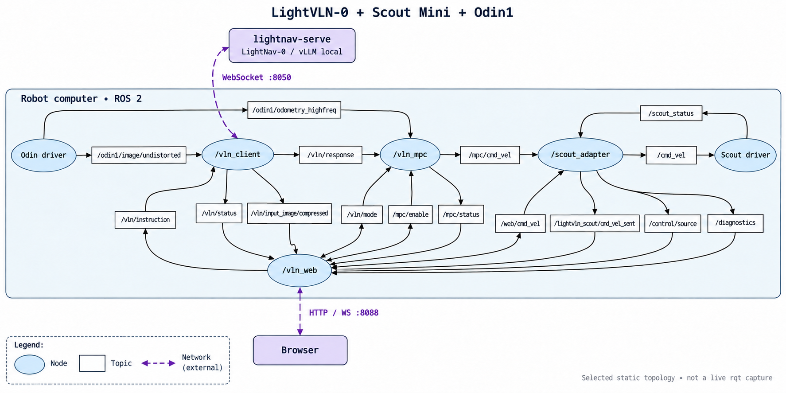

# LightVLN-0 + Scout Mini + Odin1

[English](README.md) | 简体中文

本项目基于 **LightNav-0**，完成 **Scout Mini 底盘与 Odin1 传感器的真实机器人集成**：在 GPU 服务器上运行模型推理，在机器人计算机上运行 ROS 2 感知、MPC 路径跟踪和 Scout 控制，通过浏览器完成操作与状态查看。

官方资料：[LightNav-0 模型介绍](https://www.lightorigins.com/blog/lightnav-0) · [Scout Mini 产品页](https://global.agilex.ai/products/scout-mini) · [Odin1 传感器文档](https://manifoldtechltd.github.io/wiki/odin_series/odin1/)

本仓库提供机器人端工作空间、Odin/Scout 驱动及适配代码。**推理服务源码和模型权重在独立的 LightNav-0 仓库中准备**；完整部署需要先启动服务端，再连接机器人端。

## 部署结构

| 位置 | 运行内容 | 入口 |
| --- | --- | --- |
| GPU 服务器 | LightNav-0 模型、vLLM 推理、LightNav WebSocket 服务 | `ws://<gpu-host>:8050` |
| 机器人计算机 | Odin1 驱动、VLN 客户端、MPC、Scout 适配器及底盘驱动 | 本仓库的 ROS 2 launch |
| 操作电脑 | 浏览器控制台 | `http://<robot-host>:8088` |



图中展示默认配置下的主要连接。详细接口见 [Web 与 ROS 接口](docs/web-adapter.md)。

## 适配内容

- **Odin1 感知接入**：为导航提供相机图像和里程计位姿。
- **模型输入与预览对齐**：显示实际提交推理的图像，并叠加对应帧的模型输出。
- **路径跟踪与坐标适配**：MPC 按图像采集时刻匹配里程计，并使用实测的 `imu` → `base_link` 安装偏移转换控制坐标。
- **Scout Mini 控制适配**：统一手动/自动控制权、指令超时、限速、软件急停和底盘遥测。默认关闭物理运动输出。
- **浏览器控制台**：提供相机预览、模型轨迹、任务启停、手动控制、MPC 调参和电压显示。

## 1. 部署 GPU 服务端

服务端需要独立的 **LightNav-0 源码目录、Python 3.11 环境、CUDA GPU 和模型权重**。首次在 GPU 主机上安装：

```bash
git clone https://github.com/lightorigins/LightNav-0.git
cd LightNav-0
git checkout a645828d81a8439651172197ca80a75dc1377977
uv venv --python 3.11 .venv
uv pip install --python .venv/bin/python -e '.[vllm,video]'
uv run --no-sync hf download LightOriginsHQ/LightNav-0 \
  --local-dir checkpoints/LightNav-0
uv run --no-sync python -c 'import torch; print(torch.cuda.is_available())'
```

CUDA 检查应输出 `True`。保留上游依赖约束和完整权重目录，包括 `eval_config.json` 与 `action_tokenizer/`。下载需要认证时，先完成 Hugging Face 登录与模型访问授权。已有可用环境可跳过安装。

完成环境与权重准备后，在 **GPU 服务器的 LightNav-0 仓库根目录**启动目标跟随服务：

```bash
uv run --no-sync lightnav-serve \
  --task tracking \
  --model_path "$PWD/checkpoints/LightNav-0" \
  --backend vllm_local \
  --gpu_memory_utilization 0.85 \
  --host 0.0.0.0 \
  --port 8050
```

等待日志出现 `[lightnav-ws] READY` 后，机器人端即可连接 `ws://<gpu-host>:8050`。

`tracking` 用于目标跟随；指令导航使用 `--task vln`。网页中的 `track/objnav` 是机器人端控制模式：`track` 持续跟踪路径，`objnav` 可根据模型的 `stop` 信号结束任务。它们不会替换服务端的 `--task`；切换模型任务需重启服务端或连接另一实例。

## 2. 准备机器人端

机器人端以 **Ubuntu 22.04 + ROS 2 Humble** 为目标环境，需要对应的系统 Python、C/C++ 构建工具、CMake、`colcon`、已初始化的 `rosdep` 和 [uv](https://docs.astral.sh/uv/getting-started/installation/)。ROS 安装入口见 [ROS 2 Humble 文档](https://docs.ros.org/en/humble/Installation/Ubuntu-Install-Debs.html)。

在机器人计算机上执行：

```bash
git clone https://github.com/KevinLADLee/lightvln-scout-odin.git
cd lightvln-scout-odin
./scripts/bootstrap.bash --rosdep
source scripts/env.bash
```

Zsh 使用 `source scripts/env.zsh`。Bootstrap 创建保留 ROS 系统包的 `.venv`、安装 Python 依赖并构建工作空间；依赖已安装可省略 `--rosdep`。服务端的 Python 3.11 环境与机器人端 ROS 环境应分别创建。

接着按 [硬件配置](docs/hardware.md) 完成 Scout SocketCAN、Odin USB 权限、话题及传感器安装偏移配置。

## 3. 启动机器人并连接服务端

先编辑精简后的机器人预设 [standard_stack.yaml](src/integration/lightvln_scout/config/standard_stack.yaml)，在各分组的 `ros__parameters` 下设置：

| 分组 | 配置项 |
| --- | --- |
| `vln_client` | `server_url`：`ws://<gpu-host>:8050` |
| `robot_launch` | `scout_port` 及六个实测的 `imu_to_base_*` 安装偏移 |
| `scout_adapter` | `hardware_output_enabled`：首次运行保持 `false` |

在**两个驱动均未运行**时，启动完整组合：

```bash
ros2 launch lightvln_scout scout_odin.launch.py
```

| 已有驱动状态 | 使用方式 |
| --- | --- |
| Odin、Scout 均未启动 | 上面的 `scout_odin.launch.py`，包含 Odin RViz 窗口 |
| Odin、Scout 均已启动 | 使用 `controller_only.launch.py` 及默认 YAML 配置 |

推理服务地址也可在网页中填写。独立的机器配置可通过 `params_file:=/path/to/robot.yaml` 指定，见 [参数预设](docs/hardware.md#parameter-presets)。

在操作电脑浏览器打开 **`http://<robot-host>:8088`**，按以下顺序联调：

1. 确认相机、Odin 里程计和 Scout 诊断正常，推理地址为 `ws://<gpu-host>:8050`。
2. 连接 `tracking` 服务时，选择 `track`，输入目标跟随指令并启动任务。
3. 检查服务端请求日志、客户端连接状态、推理延迟和返回轨迹。
4. 在 `hardware_output_enabled: false` 下检查推理和 MPC，最终底盘输出保持为零。
5. 完成 [硬件验证](docs/hardware.md#enable-motion-after-validation) 后，在 YAML 中设置 `hardware_output_enabled: true` 并重启。

无硬件时，使用默认预设查看界面：

```bash
ros2 launch lightvln_scout controller_only.launch.py
```

打开 `http://localhost:8088` 即可查看控制台；接入对应话题后可显示图像、里程计和底盘遥测。

## 构建与源码同步

```bash
./scripts/build.bash
ROS_DOMAIN_ID=199 ROS_LOCALHOST_ONLY=1 ./scripts/test.bash
```

修改源码或配置后，重新构建并重启节点。测试环境与更多检查命令见 [贡献指南](CONTRIBUTING.md)。

通过 SSH 将源码同步到机器人：

```bash
LIGHTNAV_DEPLOY_HOST='<user>@<robot-host>' \
LIGHTNAV_DEPLOY_ROOT='lightvln-scout-odin' \
  ./scripts/deploy_robot.bash
```

脚本同步源码，并排除 `.local/`、备份和构建产物。相对目标目录位于远端用户主目录下。同步后，在机器人目标目录运行 `./scripts/bootstrap.bash --rosdep`。认证选项见 `./scripts/deploy_robot.bash --help`。

## 配置与参考

机器人设置统一放在 `src/integration/lightvln_scout/config/standard_stack.yaml`。图像处理、接口和 MPC 的内部默认值由启动文件自动加载。

- [硬件配置](docs/hardware.md)：CAN、Odin、话题、安装 TF 与运动验证（英文技术参考）。
- [Web 与 ROS 接口](docs/web-adapter.md)：图像处理、控制权、急停、遥测、话题与服务（英文技术参考）。
- [贡献指南](CONTRIBUTING.md)：开发、测试与上游更新。
- [许可与第三方代码](LICENSES.md)：Apache-2.0 许可与组件来源。

维护者：[KevinLADLee](mailto:kevinladlee@gmail.com)。安全问题反馈见 [SECURITY.md](SECURITY.md)。

Web 服务不含用户认证或 TLS，应使用可信机器人网络或配置好的网关。机器专属配置放入 `.local/` 或仓库外。

## 上游代码

`src/lightnav/` 保存 LightNav 机器人端组件，`src/integration/lightvln_scout/` 负责 Scout/Odin 适配，`src/drivers/` 保存驱动快照。

| 组件 | 上游 revision | 说明 |
| --- | --- | --- |
| [LightNav-0](https://github.com/lightorigins/LightNav-0) | [`a645828`](https://github.com/lightorigins/LightNav-0/commit/a645828d81a8439651172197ca80a75dc1377977) | 机器人端组件快照；本地修改见 [UPSTREAM_VERSION](src/lightnav/UPSTREAM_VERSION) |
| [Manifold Odin ROS driver](https://github.com/manifoldsdk/odin_ros_driver) | [`a592cf2`](https://github.com/manifoldsdk/odin_ros_driver/commit/a592cf2cc08bc8bfb0dceae44ef31f3a6bd77822) | 包含本项目配置和运行路径修改 |
| [Scout ROS 2](https://github.com/Hive-Matrix-AI/scout_ros2) | [`165083d`](https://github.com/Hive-Matrix-AI/scout_ros2/commit/165083d93942955870a96bd1b984a7b9f6f4fcdd) | 上游 `humble` 分支快照 |
| [AgileX UGV SDK](https://github.com/Hive-Matrix-AI/agilex_ugv_sdk) | [`c3fa0c9`](https://github.com/Hive-Matrix-AI/agilex_ugv_sdk/commit/c3fa0c92144dda542c45b12b7bf3c0ba8e635159) | 位于 `src/drivers/scout_ros2/third_party/` |
